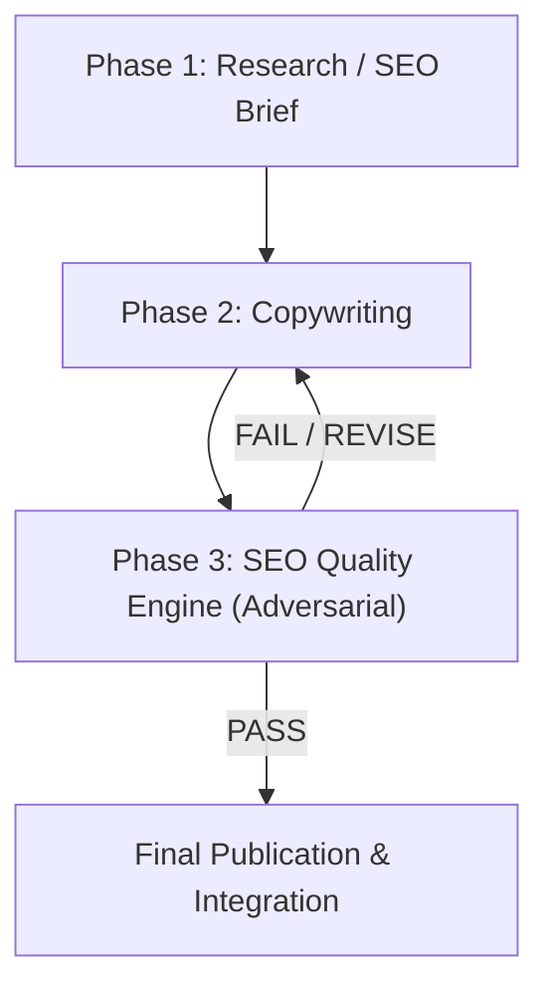

# THE THREE-PROMPT SEO CONTENT OPERATING SYSTEM

This document contains the permanent reference specifications for the Three-Prompt SEO Content System.

---

## WORKFLOW OVERVIEW

---

## PHASE 1: RESEARCH / SEO BRIEF

### Input
* Primary keyword
* Target country
* Target language
* Website
* Business/product context
* Known internal URLs
* Competitor URLs

### 11-Step Structure
1. **Search Intent**: Primary & secondary intent, user goal, baseline knowledge, immediate answer required, page format (informational, commercial, transactional, comparison, troubleshooting).
2. **SERP Analysis**: Dominant formats, common headings, common coverage, content gaps, outdated/weak explanations.
3. **Entity Map**: Primary entity, related entities, products/apps, devices, protocols, platforms, error terminology.
4. **User Questions**: Must Answer, Should Answer, Optional.
5. **Competitive Gap**: What competitors do well, where they fail, missing elements, actionable opportunities.
6. **Original Value Plan**: First-hand testing, device tests, real errors, comparison tables, or `[REQUIRES FIRST-HAND EVIDENCE]`.
7. **Content Architecture**: Section-by-section outline (Section, Purpose, User Question, Key Entities, Information Required, Original Value Opportunity, Internal Link Opportunity).
8. **Internal Linking**: Destination, Anchor, Placement, Reason.
9. **Trust & Evidence**: Claims requiring verification, preferred primary sources.
10. **SEO Metadata**: SEO Title, H1, Meta Description, URL Slug.
11. **Final Content Brief**: Executive summary of core requirements.

---

## PHASE 2: COPYWRITING

### Rules & Standards
* **Answer First**: Provide the core solution immediately; zero introductory fluff.
* **No Fluff / Word Count Inflation**: If 1,200 words satisfies intent, do not write 2,500.
* **Strictly Banned Clichés**: No *"In today's digital landscape"*, *"Whether you're a..."*, *"Unlock the power of..."*, *"Leverage..."*, *"Seamlessly..."*, *"Game-changing"*, *"Ultimate guide"*, *"Revolutionize"*, *"Everything you need to know"*.
* **Zero Fabricated Evidence**: Insert placeholder tags `[ADD REAL EXPERIENCE]`, `[ADD SCREENSHOT]`, `[ADD TEST RESULT]` if physical verification data is absent.
* **IPTV Precision**: Exact technical accuracy on codecs (H.264/HEVC), protocols (M3U, Xtream Codes), EPG XMLTV, buffer configurations, and OS constraints (Fire OS, Android TV, webOS, Tizen, tvOS).

### Required Output
1. Final Article Body
2. SEO Title
3. Meta Description
4. H1
5. Suggested URL Slug
6. Internal Linking Recommendations
7. Image / Screenshot Opportunities
8. Claims Requiring Fact-Checking
9. Missing First-Hand Evidence
10. Final Editorial Notes

---

## PHASE 3: SEO QUALITY ENGINE (ADVERSARIAL GATE)

### Evaluation Framework (15 Tests)
1. **Search Intent** (/10): Immediate resolution, correct format, zero distraction.
2. **Original Value** (/10): True differentiation vs 100 generic AI articles.
3. **First-Hand Experience** (/10): Zero fabricated experience or false testing claims.
4. **Factual Accuracy** (/10): Verified specs, pricing, versions, protocols, and claims.
5. **AI Boilerplate** (/10): Absence of generic templates, empty phrases, and corporate filler.
6. **Template / Scaled Risk** (Low / Med / High): Unique substance vs mass-produced patterns.
7. **Topical Coverage** (/10): Completeness of essential user concepts.
8. **Keyword Quality** (/10): Natural rhythm, no artificial density manipulation.
9. **Structure** (/10): Scannability, clear H2/H3 hierarchy, tables/lists where useful.
10. **Internal Linking** (/10): Relevant destinations, natural anchors, clear user utility.
11. **Trust** (/10): Transparency, verifiable statements, accurate disclaimers.
12. **Commercial Intent** (/10): Non-deceptive CTAs, factual subscription terms.
13. **IPTV-Specific Risk**: Zero unsupported "100% uptime" or "zero buffering" statements.
14. **User Experience** (/10): Complete satisfaction without needing to return to Google.
15. **Competitive Value**: Explicitly superior to ranking competitor alternatives.

### Automatic Fail Conditions
* Search intent unsatisfied.
* Unsupported factual or commercial claims.
* Fabricated experience or reviews.
* Substantially generic or templated copy.
* Sections created solely for keyword stuffing.
* Serious factual errors in IPTV protocols or compatibility.

### Output Structure
* **VERDICT**: PASS / FAIL
* **SCORE**: XX / 100
* **CRITICAL PROBLEMS**
* **FACTUAL ISSUES**
* **AI / BOILERPLATE ISSUES**
* **ORIGINALITY PROBLEMS**
* **SEARCH INTENT PROBLEMS**
* **SEO PROBLEMS**
* **IPTV-SPECIFIC PROBLEMS**
* **REQUIRED FIXES** (in priority order)
* **OPTIONAL IMPROVEMENTS**
* **MISSING EVIDENCE**
* **PUBLISH DECISION**: PUBLISH / REVISE / DO NOT PUBLISH
