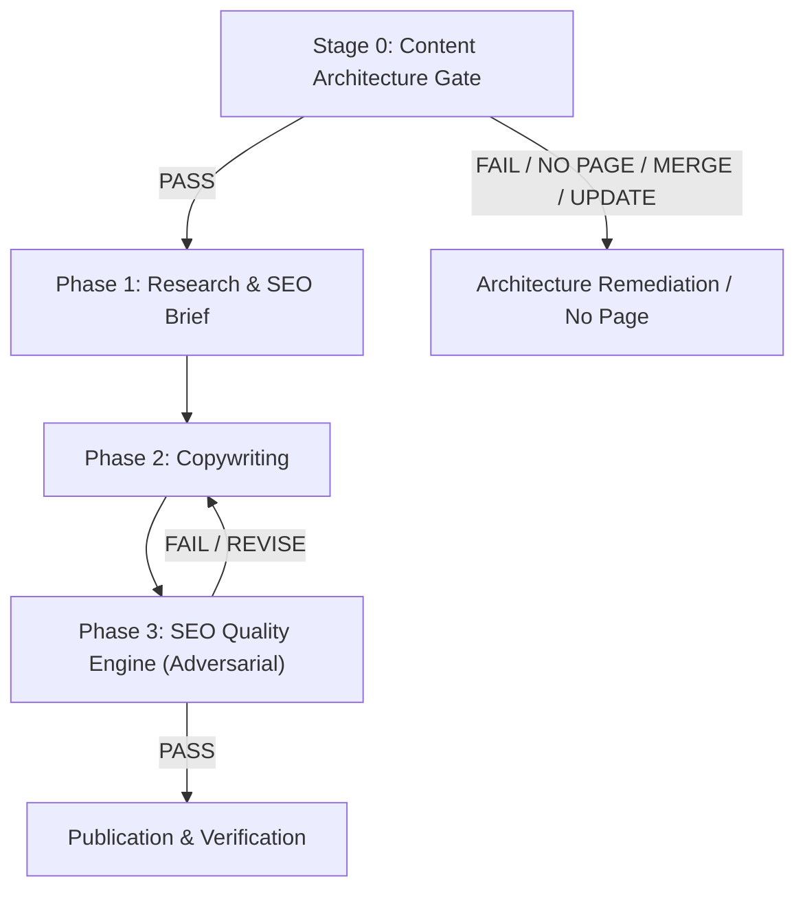

# CONTENT ARCHITECTURE GATE (STAGE 0)

This document defines the mandatory **SEO Content Architecture Gate** that must execute and return `PASS` BEFORE any SEO task proceeds to Phase 1 (Research / SEO Brief).

---

## 1. NON-NEGOTIABLE RULE

> **NEVER create a new URL before inspecting the existing site architecture and determining whether an existing page already satisfies the same or substantially overlapping search intent.**

```text
USER NEED
> SEARCH INTENT
> SITE ARCHITECTURE
> CONTENT QUALITY
> ORIGINAL VALUE
> SEO
> URL COUNT
```

Never optimize for the number of pages created.

---

## 2. MANDATORY FOUR-STAGE PIPELINE



---

## 3. PAGE TYPE CLASSIFICATION

Every proposed page must be assigned exactly ONE primary page type:
* `COMMERCIAL LANDING PAGE`
* `INFORMATIONAL GUIDE`
* `TROUBLESHOOTING GUIDE`
* `COMPARISON`
* `DEVICE GUIDE`
* `APP GUIDE`
* `TOOL / CALCULATOR`
* `CATEGORY / HUB`
* `LOCAL PAGE` (Strict scrutiny: genuine local utility required)
* `RESOURCE`
* `NEWS / UPDATE`
* `NO PAGE`

---

## 4. ARCHITECTURE DECISION MATRIX

Select exactly ONE decision:
* `CREATE NEW`: Defensible, non-overlapping, distinct intent, high original value.
* `UPDATE EXISTING`: Existing page already targets intent; enhance or add section.
* `MERGE`: Multiple existing pages overlap; consolidate into single authority URL.
* `REDIRECT`: Obsolete URL with inbound value mapped to relevant destination.
* `NO PAGE`: Search intent already met, thin/doorway risk, or no unique value.

---

## 5. IPTV-SPECIFIC PROHIBITIONS

* **No Keyword-Variant Commercial Duplicates**: Do not create separate pages for "IPTV provider", "best IPTV subscription", "cheap IPTV", etc. when the commercial hub/tier architecture already covers them.
* **No Scaled/Templated Country Pages**: Never spawn `/country/*` pages simply by swapping country names or currencies. Unless genuine, distinct local infrastructure, licensing, and broadcast content exist, the decision is `NO PAGE`.
* **No Redundant Device/App Pages**: Consolidate if the setup steps, hardware limitations, and troubleshooting are functionally identical across variants.

---

## 6. MANDATORY ARCHITECTURE REPORT TEMPLATE (SECTION 27)

Every task must output this exact structure before Phase 1 begins:

```text
# CONTENT ARCHITECTURE GATE

## Target
Keyword / Topic:
Requested URL:
Requested Page Type:

## Existing Site Analysis
Relevant Existing URLs:

## Search Intent
Primary Intent:
Secondary Intent:

## Existing Intent Match
Best Existing URL:
Does Existing URL Already Satisfy Intent?
YES / PARTIALLY / NO

## Cannibalization
Risk:
LOW / MEDIUM / HIGH / CRITICAL

Potentially Competing URLs:

## Page Type
Recommended Page Type:

## Architecture Decision
CREATE NEW / UPDATE EXISTING / MERGE / REDIRECT / NO PAGE

## Justification
[Clear explanation]

## Unique Value
What will this page provide that existing pages do not?

## Content Cluster
Parent:
Siblings:
Supporting Pages:

## Internal Linking
Incoming Links:
Outgoing Links:

## Indexability
INDEX / NOINDEX / REDIRECT / 410 / NOT PUBLISHED

## Canonical
Canonical URL:

## Programmatic / Scaled Content Risk
LOW / MEDIUM / HIGH

## Final Architecture Gate
PASS / FAIL
```
